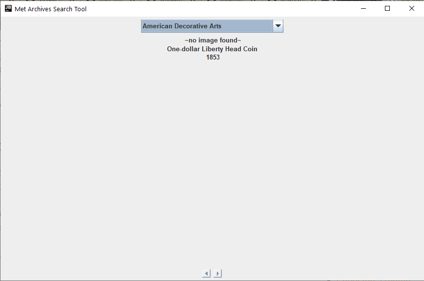
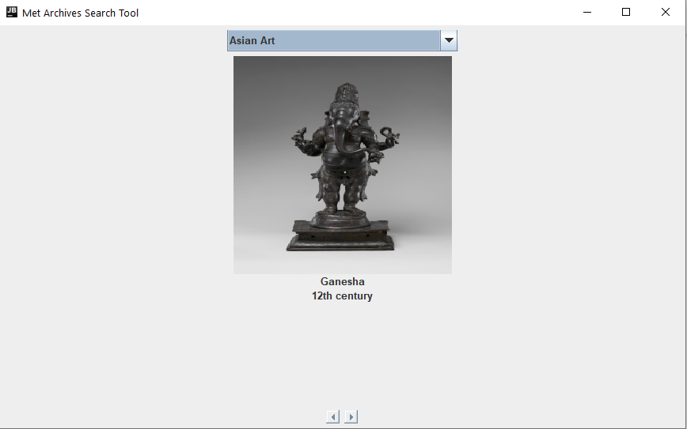

Metropolitan Museum of Art API Display
=======

A project completed for MCON 152 Computer Methodology class. Utilizes
the [Met Collection API](https://metmuseum.github.io/) to create a simple
search engine for the Met's complete collection catalog.

Demonstrates:
* API
* JSON
* Retrofit
* Gradle
* Mockito
* Model-View-Controller pattern
* Factory pattern
* Executable [jar](build/libs/neomet-1.0-SNAPSHOT.jar) file
* Markdown

